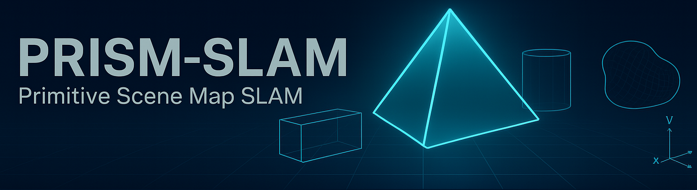

# PRISM-SLAM
**PRImitive Scene Map SLAM** — a hybrid visual SLAM that combines a **scene-coordinate head** (PnP/DSAC) for precise pose with a **primitive-shape head** (planes/cuboids/cylinders/superquadrics) for a **tiny, planner-ready map**.

[](https://colab.research.google.com/github/guybarnahum/prism-slam/blob/main/notebooks/PRISM_SLAM_Colab.ipynb)

> Compact, navigation-grade maps with loop closures and multi-session merging — without photorealistic reconstruction.

## Highlights
- **Hybrid**: Scene-coordinates → tight 6-DoF pose; Primitive set-prediction → compact map
- **Planner-friendly**: direct ESDF/costmap derivation from shapes
- **Dynamic-aware**: masks movers before both heads
- **Colab-first**: launch the paper/notebook above; edit & run in the cloud

## Repo Layout
```
.
├── LICENSE
├── README.md
├── examples
│   └── minimal_scene
│       ├── images
│       │   └── 000001.png
│       ├── meta
│       │   └── 000001.json
│       └── primitives
│           └── 000001.json
├── notebooks
│   └── PRISM_SLAM_Colab.ipynb
├── pyproject.toml
├── requirements.txt
├── scripts
│   └── validate_dataset.py
└── src
    └── prismslam
        ├── __init__.py
        ├── datasets
        │   └── __init__.py
        ├── matching.py
        ├── primitives.py
        └── schemas
            ├── frame_meta.schema.json
            └── primitive.schema.json
```

---

## Quickstart

```bash
# Clone
git clone git@github.com:guybarnahum/prism-slam.git
cd prism-slam

# One-time permissions
chmod +x setup.sh clean.sh
```

### Install (pyproject-only)

**macOS** (CPU/MPS) **or** **Linux (CPU)**:

```bash
./setup.sh
```

**Linux + NVIDIA GPU** (e.g., T4/Ampere; choose CUDA channel if needed):

```bash
# cu124 is default. You can also use cu121 or cu122.
TORCH_CHANNEL=cu124 ./setup.sh t4_gpu
```

**Verify install:**

```bash
source .venv/bin/activate
python -c "import torch, torchvision; print(torch.__version__, torchvision.__version__)"
```

**Validate the sample dataset structure:**

```bash
python scripts/validate_dataset.py examples/minimal_scene
```

> The installer pins Torch to platform-appropriate versions (macOS: 2.2.2/0.17.2; Linux GPU: 2.4.2/0.19.1) and installs project deps from **`pyproject.toml`** extras (`.[cpu]` or `.[t4_gpu]`). No `requirements.txt` needed.

---

## Uninstall / Clean

```bash
# Full clean: uninstall package, remove .venv, wipe caches/artifacts
./clean.sh

# Non-interactive
./clean.sh --yes

# Keep venv; only wipe artifacts (logs, caches, outputs)
./clean.sh --artifacts-only

# Only remove the venv (and uninstall inside it)
./clean.sh --venv-only --yes

# See actions without deleting
./clean.sh --dry-run
```

---

### Notes

* **CUDA channel**: set `TORCH_CHANNEL` to `cu121`, `cu122`, or `cu124` before `./setup.sh t4_gpu`.
* **Hugging Face (optional)**: if you use private models, set `HUGGINGFACE_HUB_TOKEN` in your environment before running `setup.sh` to auto-login.

## Dataset (brief)
Per-frame JSON (`meta/{frame}.json`):
```json
{ "frame_id": 1, "rgb_path": "images/000001.png", "K": [[fx,0,cx],[0,fy,cy],[0,0,1]],
   "T_cw": [[...],[...],[...],[0,0,0,1]], "scene_id": "scene_000" }
```
Scene-coords: `scene_coords/{frame}.npz` with `uv (N,2)`, `XYZ (N,3)`.  
Primitives: `primitives/{frame}.json` (or per-scene) with items of `type` ∈ {plane,cuboid,cylinder,superquadric} and params.  
See **notebooks/PRISM_SLAM_Colab.ipynb** for full spec.

## Colab
- Click the badge above. The notebook reads like a short paper and includes dataset schemas and code stubs.
- To use GitHub Releases for datasets, upload zips to your repo’s Releases and `wget` them in Colab.

## License
MIT © 2025 PRISM-SLAM contributors
